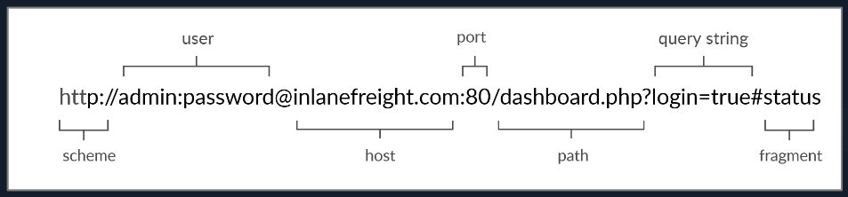

# HyperText Transfer Protocol (HTTP)

Today, the majority of the applications we use constantly interact with the internet, both web and mobile applications. Most internet communications are made with web requests through the HTTP protocol. [HTTP](https://tools.ietf.org/html/rfc2616) is an application-level protocol used to access the World Wide Web resources. The term `hypertext` stands for text containing links to other resources and text that the readers can easily interpret.

HTTP communication consists of a client and a server, where the client requests the server for a resource. The server processes the requests and returns the requested resource. The default port for HTTP communication is port `80`, though this can be changed to any other port, depending on the web server configuration. The same requests are utilized when we use the internet to visit different websites. We enter a `Fully Qualified Domain Name` (`FQDN`) as a `Uniform Resource Locator` (`URL`) to reach the desired website, like [www.hackthebox.com](http://www.hackthebox.com/).

---

## URL

Resources over HTTP are accessed via a `URL`, which offers many more specifications than simply specifying a website we want to visit. Let's look at the structure of a URL:



Here is what each component stands for:

| **Component** | **Example** | **Description** |
| --- | --- | --- |
| `Scheme` | `http://` `https://` | This is used to identify the protocol being accessed by the client, and ends with a colon and a double slash (`://`) |
| `User Info` | `admin:password@` | This is an optional component that contains the credentials (separated by a colon `:`) used to authenticate to the host, and is separated from the host with an at sign (`@`) |
| `Host` | `inlanefreight.com` | The host signifies the resource location. This can be a hostname or an IP address |
| `Port` | `:80` | The `Port` is separated from the `Host` by a colon (`:`). If no port is specified, `http` schemes default to port `80` and `https` default to port `443` |
| `Path` | `/dashboard.php` | This points to the resource being accessed, which can be a file or a folder. If there is no path specified, the server returns the default index (e.g. `index.html`). |
| `Query String` | `?login=true` | The query string starts with a question mark (`?`), and consists of a parameter (e.g. `login`) and a value (e.g. `true`). Multiple parameters can be separated by an ampersand (`&`). |
| `Fragments` | `#status` | Fragments are processed by the browsers on the client-side to locate sections within the primary resource (e.g. a header or section on the page). |

Not all components are required to access a resource. The main mandatory fields are the scheme and the host, without which the request would have no resource to request.

---

## HTTP Flow


The diagram above presents the anatomy of an HTTP request at a very high level. The first time a user enters the URL (`inlanefreight.com`) into the browser, it sends a request to a DNS (Domain Name Resolution) server to resolve the domain and get its IP. The DNS server looks up the IP address for `inlanefreight.com` and returns it. All domain names need to be resolved this way, as a server can't communicate without an IP address.

**Note:** Our browsers usually first look up records in the local '`/etc/hosts`' file, and if the requested domain does not exist within it, then they would contact other DNS servers. We can use the '`/etc/hosts` on Linux/Mac or `c:\Windows\System32\Drivers\etc\hosts` on Windows' to manually add records for DNS resolution, by adding the IP followed by the domain name.

Once the browser gets the IP address linked to the requested domain, it sends a GET request to the default HTTP port (e.g. `80`), asking for the root `/` path. Then, the web server receives the request and processes it. By default, servers are configured to return an index file when a request for `/` is received.

In this case, the contents of `index.html` are read and returned by the web server as an HTTP response. The response also contains the status code (e.g. `200 OK`), which indicates that the request was successfully processed. The web browser then renders the `index.html` contents and presents it to the user.

**Note:** This module is mainly focused on HTTP web requests. For more on HTML and web applications, you may refer to the [Introduction to Web Applications](https://academy.hackthebox.com/module/details/75) module.

---

## cURL

In this module, we will be sending web requests through two of the most important tools for any web penetration tester, a Web Browser, like Chrome or Firefox, and the `cURL` command line tool.

[cURL](https://curl.haxx.se/) (client URL) is a command-line tool and library that primarily supports HTTP along with many other protocols. This makes it a good candidate for scripts as well as automation, making it essential for sending various types of web requests from the command line, which is necessary for many types of web penetration tests.

We can send a basic HTTP request to any URL by using it as an argument for cURL, as follows:

```shell-session
user@htb[/htb]$ curl inlanefreight.com

<!DOCTYPE HTML PUBLIC "-//IETF//DTD HTML 2.0//EN">
<html><head>
...SNIP...
```

We see that cURL does not render the HTML/JavaScript/CSS code, unlike a web browser, but prints it in its raw format. However, as penetration testers, we are mainly interested in the request and response context, which usually becomes much faster and more convenient than a web browser.

We may also use cURL to download a page or a file and output the content into a file using the `-O` flag. If we want to specify the output file name, we can use the `-o` flag and specify the name. Otherwise, we can use `-O` and cURL will use the remote file name, as follows:

```shell-session
user@htb[/htb]$ curl -O inlanefreight.com/index.html
user@htb[/htb]$ ls
index.html
```

As we can see, the output was not printed this time but rather saved into `index.html`. We noticed that cURL still printed some status while processing the request. We can silent the status with the `-s` flag, as follows:

```shell-session
user@htb[/htb]$ curl -s -O inlanefreight.com/index.html
```

This time, cURL did not print anything, as the output was saved into the `index.html` file. Finally, we may use the `-h` flag to see what other options we may use with cURL:

```shell-session
user@htb[/htb]$ curl -h
Usage: curl [options...] <url>
 -d, --data <data>   HTTP POST data
 -h, --help <category> Get help for commands
 -i, --include       Include protocol response headers in the output
 -o, --output <file> Write to file instead of stdout
 -O, --remote-name   Write output to a file named as the remote file
 -s, --silent        Silent mode
 -u, --user <user:password> Server user and password
 -A, --user-agent <name> Send User-Agent <name> to server
 -v, --verbose       Make the operation more talkative

This is not the full help, this menu is stripped into categories.
Use "--help category" to get an overview of all categories.
Use the user manual `man curl` or the "--help all" flag for all options.
```

As the above message mentions, we may use `--help all` to print a more detailed help menu, or `--help category` (e.g. `-h http`) to print the detailed help of a specific flag. If we ever need to read more detailed documentation, we can use `man curl` to view the full cURL manual page.

In the upcoming sections, we will cover most of the above flags and see where we should use each of them.

#### Questions

Answer the question(s) below to complete this Section and earn cubes!

Example Target: [192.168.0.1:34767](192.168.0.1:34767)

To get the flag, start the above exercise, then use cURL to download the file returned by '/download.php' in the server shown above.

`curl 192.168.0.1:34767/download.php`

- HTB{answer_will_look_like_this}root@u64-test:~#
- My answer didn't print a new line so the below is how the answer should look.
- HTB{answer_will_look_like_this}


# Hypertext Transfer Protocol Secure (HTTPS)

In the previous section, we discussed how HTTP requests are sent and processed. However, one of the significant drawbacks of HTTP is that all data is transferred in clear-text. This means that anyone between the source and destination can perform a Man-in-the-middle (MiTM) attack to view the transferred data.

To counter this issue, the [HTTPS (HTTP Secure) protocol](https://tools.ietf.org/html/rfc2660) was created, in which all communications are transferred in an encrypted format, so even if a third party does intercept the request, they would not be able to extract the data out of it. For this reason, HTTPS has become the mainstream scheme for websites on the internet, and HTTP is being phased out, and soon most web browsers will not allow visiting HTTP websites.

---

## HTTPS Overview

If we examine an HTTP request, we can see the effect of not enforcing secure communications between a web browser and a web application. For example, the following is the content of an HTTP login request:


We can see that the login credentials can be viewed in clear-text. This would make it easy for someone on the same network (such as a public wireless network) to capture the request and reuse the credentials for malicious purposes.

In contrast, when someone intercepts and analyzes traffic from an HTTPS request, they would see something like the following:


As we can see, the data is transferred as a single encrypted stream, which makes it very difficult for anyone to capture information such as credentials or any other sensitive data.

Websites that enforce HTTPS can be identified through `https://` in their URL (e.g. https://www.google.com), as well as the lock icon in the address bar of the web browser, to the left of the URL:


So, if we visit a website that utilizes HTTPS, like Google, all traffic would be encrypted.

**Note:** Although the data transferred through the HTTPS protocol may be encrypted, the request may still reveal the visited URL if it contacted a clear-text DNS server. For this reason, it is recommended to utilize encrypted DNS servers (e.g. 8.8.8.8 or 1.1.1.1), or utilize a VPN service to ensure all traffic is properly encrypted.

---

## HTTPS Flow

Let's look at how HTTPS operates at a high level:


If we type `http://` instead of `https://` to visit a website that enforces HTTPS, the browser attempts to resolve the domain and redirects the user to the webserver hosting the target website. A request is sent to port `80` first, which is the unencrypted HTTP protocol. The server detects this and redirects the client to secure HTTPS port `443` instead. This is done via the `301 Moved Permanently` response code, which we will discuss in an upcoming section.

Next, the client (web browser) sends a "client hello" packet, giving information about itself. After this, the server replies with "server hello", followed by a [key exchange](https://en.wikipedia.org/wiki/Key_exchange) to exchange SSL certificates. The client verifies the key/certificate and sends one of its own. After this, an encrypted [handshake](https://www.cloudflare.com/learning/ssl/what-happens-in-a-tls-handshake) is initiated to confirm whether the encryption and transfer are working correctly.

Once the handshake completes successfully, normal HTTP communication is continued, which is encrypted after that. This is a very high-level overview of the key exchange, which is beyond this module's scope.

**Note:** Depending on the circumstances, an attacker may be able to perform an HTTP downgrade attack, which downgrades HTTPS communication to HTTP, making the data transferred in clear-text. This is done by setting up a Man-In-The-Middle (MITM) proxy to transfer all traffic through the attacker's host without the user's knowledge. However, most modern browsers, servers, and web applications protect against this attack.

---

## cURL for HTTPS

cURL should automatically handle all HTTPS communication standards and perform a secure handshake and then encrypt and decrypt data automatically. However, if we ever contact a website with an invalid SSL certificate or an outdated one, then cURL by default would not proceed with the communication to protect against the earlier mentioned MITM attacks:

```shell-session
user@htb[/htb]$ curl https://inlanefreight.com

curl: (60) SSL certificate problem: Invalid certificate chain
More details here: https://curl.haxx.se/docs/sslcerts.html
...SNIP...
```

Modern web browsers would do the same, warning the user against visiting a website with an invalid SSL certificate.

We may face such an issue when testing a local web application or with a web application hosted for practice purposes, as such web applications may not yet have implemented a valid SSL certificate. To skip the certificate check with cURL, we can use the `-k` flag:

```shell-session
user@htb[/htb]$ curl -k https://inlanefreight.com

<!DOCTYPE HTML PUBLIC "-//IETF//DTD HTML 2.0//EN">
<html><head>
...SNIP...
```

As we can see, the request went through this time, and we received the response data.


