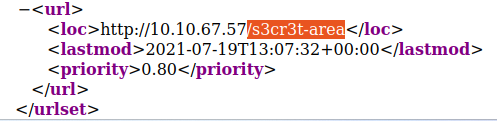

# Content Discovery
   
Learn the various ways of discovering hidden or private content on a webserver that could lead to new vulnerabilities.
[Link](https://tryhackme.com/room/contentdiscovery)


# 1: What Is Content Discovery?

Firstly, we should ask, in the context of web application security, what is content? Content can be many things, a file, video, picture, backup, a website feature. When we talk about content discovery, we're not talking about the obvious things we can see on a website; it's the things that aren't immediately presented to us and that weren't always intended for public access.  
  
This content could be, for example, pages or portals intended for staff usage, older versions of the website, backup files, configuration files, administration panels, etc.  
  
There are three main ways of discovering content on a website which we'll cover. Manually, Automated and OSINT (Open-Source Intelligence).  
  
Start the AttackBox (by clicking the blue "Start AttackBox" button), and the machine on this task.

## Answer the questions below

What is the Content Discovery method that begins with M?

- Manually

What is the Content Discovery method that begins with A?

- Automated 

What is the Content Discovery method that begins with O?

- OSINT


# 2: Manual Discovery - Robots.txt

There are multiple places we can manually check on a website to start discovering more content. 

  

**Robots.txt**

The robots.txt file is a document that tells search engines which pages they are and aren't allowed to show on their search engine results or ban specific search engines from crawling the website altogether. It can be common practice to restrict certain website areas so they aren't displayed in search engine results. These pages may be areas such as administration portals or files meant for the website's customers. This file gives us a great list of locations on the website that the owners don't want us to discover as penetration testers.

  

Take a look at the robots.txt file on the Acme IT Support website to see if they have anything they don't want to list - To do this open Firefox on the AttackBox, and enter the url: [http://MACHINE\_IP/robots.txt](http://machine_ip/robots.txt)[](https://lab_web_url.p.thmlabs.com/robots.txt) (_this URL will update 2 minutes from when you start the machine in task 1_)

## Answer the questions below

What is the directory in the robots.txt that isn't allowed to be viewed by web crawlers?

- /staff-portal


# 3: Manual Discovery - Favicon

**Favicon**

The favicon is a small icon displayed in the browser's address bar or tab used for branding a website.

  


  

Sometimes when frameworks are used to build a website, a favicon that is part of the installation gets leftover, and if the website developer doesn't replace this with a custom one, this can give us a clue on what framework is in use. OWASP host a database of common framework icons that you can use to check against the targets favicon [https://wiki.owasp.org/index.php/OWASP\_favicon\_database](https://wiki.owasp.org/index.php/OWASP_favicon_database). Once we know the framework stack, we can use external resources to discover more about it (see next section).

  

**Practical Exercise:**

  

On the AttackBox, open firefox and enter the url [https://static-labs.tryhackme.cloud/sites/favicon/](https://static-labs.tryhackme.cloud/sites/favicon/) here you'll see a basic website with a note saying "Website coming soon...", if you look at your tabs you'll notice an icon that confirms this site is using a favicon.

  

Viewing the page source you'll see line six contains a link to the images/favicon.ico file. 

  

  

  

If you run the following command on the AttackBox, it will download the favicon and get its md5 hash value which you can then lookup on the  
[https://wiki.owasp.org/index.php/OWASP\_favicon\_database](https://wiki.owasp.org/index.php/OWASP_favicon_database).

  

```bash
user@machine$ curl https://static-labs.tryhackme.cloud/sites/favicon/images/favicon.ico | md5sum
```
        

Note: This curl will fail on the AttackBox if you are a free user, in which case you should use a VM for this. If your hash ends with 427e then your curl failed, and you may need to try it again. You could also run this on Windows in Powershell as shown below.  

  

```PowerShell
PS C:\> curl https://static-labs.tryhackme.cloud/sites/favicon/images/favicon.ico -UseBasicParsing -o favicon.ico
PS C:\> Get-FileHash .\favicon.ico -Algorithm MD5
``` 

## Answer the questions below

What framework did the favicon belong to?

- `curl https://static-labs.tryhackme.cloud/sites/favicon/images/favicon.ico | md5sum`
- f276b19aabcb4ae8cda4d22625c6735f
- use `ctrl + f` to search the OWASP site for the md5sum
- cgiirc


# 4: Manual Discovery - Sitemap.xml

**Sitemap.xml**

Unlike the robots.txt file, which restricts what search engine crawlers can look at, the sitemap.xml file gives a list of every file the website owner wishes to be listed on a search engine. These can sometimes contain areas of the website that are a bit more difficult to navigate to or even list some old webpages that the current site no longer uses but are still working behind the scenes.

  

Take a look at the sitemap.xml file on the Acme IT Support website to see if there's any new content we haven't yet discovered: [http://10.10.67.57/sitemap.xml](http://10.10.67.57/sitemap.xml)[](http://10.10.67.57/sitemap.xml) (open this in the FireFox browser on the AttackBox).

## Answer the questions below

What is the path of the secret area that can be found in the sitemap.xml file?

- /s3cr3t-area




# 5: Manual Discovery - HTTP Headers

**HTTP Headers**

When we make requests to the web server, the server returns various HTTP headers. These headers can sometimes contain useful information such as the webserver software and possibly the programming/scripting language in use. In the below example, we can see the webserver is NGINX version 1.18.0 and runs PHP version 7.4.3. Using this information, we could find vulnerable versions of software being used. Try running the below curl command against the web server, where the **\-v** switch enables verbose mode, which will output the headers (there might be something interesting!).

  

```bash
user@machine$ curl http://10.10.67.57 -v
*   Trying 10.10.67.57:80...
* TCP_NODELAY set
* Connected to MACHINE_IP (MACHINE_IP) port 80 (#0)
> GET / HTTP/1.1
> Host: MACHINE_IP
> User-Agent: curl/7.68.0
> Accept: */*
> 
* Mark bundle as not supporting multiuse
< HTTP/1.1 200 OK
< Server: nginx/1.18.0 (Ubuntu)
< X-Powered-By: PHP/7.4.3
< Date: Mon, 19 Jul 2021 14:39:09 GMT
< Content-Type: text/html; charset=UTF-8
< Transfer-Encoding: chunked
< Connection: keep-alive
```
        

## Answer the questions below

What is the flag value from the X-FLAG header?

- `curl http://10.10.67.57 -v`
- THM{HEADER_FLAG}


# 6: Manual Discovery - Framework Stack

**Framework Stack**

Once you've established the framework of a website, either from the above favicon example or by looking for clues in the page source such as comments, copyright notices or credits, you can then locate the framework's website. From there, we can learn more about the software and other information, possibly leading to more content we can discover.

  

Looking at the page source of our Acme IT Support website ([http://10.10.67.57](http://10.10.67.57/)), you'll see a comment at the end of every page with a page load time and also a link to the framework's website, which is [https://static-labs.tryhackme.cloud/sites/thm-web-framework](https://static-labs.tryhackme.cloud/sites/thm-web-framework). Let's take a look at that website. Viewing the documentation page gives us the path of the framework's administration portal, which gives us a flag if viewed on the Acme IT Support website.

## Answer the questions below

What is the flag from the framework's administration portal?

- `http://10.10.67.57/thm-framework-login`
- THM{CHANGE_DEFAULT_CREDENTIALS}


# 7: OSINT - Google Hacking / Dorking

There are also external resources available that can help in discovering information about your target website; these resources are often referred to as OSINT or (Open-Source Intelligence) as they're freely available tools that collect information:

  

**Google Hacking / Dorking**

Google hacking / Dorking utilizes Google's advanced search engine features, which allow you to pick out custom content. You can, for instance, pick out results from a certain domain name using the **site:** filter, for example (site:[tryhackme.com](http://tryhackme.com/)) you can then match this up with certain search terms, say, for example, the word admin (site:tryhackme.com admin) this then would only return results from the [tryhackme.com](http://tryhackme.com/) website which contain the word admin in its content. You can combine multiple filters as well. Here is an example of more filters you can use:

<table class="table table-bordered"><tbody><tr><td><b>Filter</b><br></td><td><b>Example</b><br></td><td><b>Description</b><br></td></tr><tr><td>site<br></td><td>site:tryhackme.com<br></td><td>returns results only from the specified website address<br></td></tr><tr><td>inurl<br></td><td>inurl:admin<br></td><td>returns results that have the specified word in the URL<br></td></tr><tr><td>filetype<br></td><td>filetype:pdf<br></td><td>returns results which are a particular file extension<br></td></tr><tr><td>intitle<br></td><td>intitle:admin<br></td><td>returns results that contain the specified word in the title<br></td></tr></tbody></table>

  

More information about google hacking can be found here: [https://en.wikipedia.org/wiki/Google\_hacking](https://en.wikipedia.org/wiki/Google_hacking)

## Answer the questions below

What Google dork operator can be used to only show results from a particular site?

- site:


# 8: OSINT - Wappalyzer

**Wappalyzer**

Wappalyzer ([https://www.wappalyzer.com/](https://www.wappalyzer.com/)) is an online tool and browser extension that helps identify what technologies a website uses, such as frameworks, Content Management Systems (CMS), payment processors and much more, and it can even find version numbers as well.

## Answer the questions below

What online tool can be used to identify what technologies a website is running?

- wappalyzer


# 9: OSINT - Wayback Machine

**Wayback Machine**

The Wayback Machine ([https://archive.org/web/](https://archive.org/web/)) is a historical archive of websites that dates back to the late 90s. You can search a domain name, and it will show you all the times the service scraped the web page and saved the contents. This service can help uncover old pages that may still be active on the current website.

## Answer the questions below

What is the website address for the Wayback Machine?

- `https://archive.org/web/`


# 10: OSINT - GitHub

**GitHub**

To understand GitHub, you first need to understand Git. Git is a **version control system** that tracks changes to files in a project. Working in a team is easier because you can see what each team member is editing and what changes they made to files. When users have finished making their changes, they commit them with a message and then push them back to a central location (repository) for the other users to then pull those changes to their local machines. GitHub is a hosted version of Git on the internet. Repositories can either be set to public or private and have various access controls. You can use GitHub's search feature to look for company names or website names to try and locate repositories belonging to your target. Once discovered, you may have access to source code, passwords or other content that you hadn't yet found.

## Answer the questions below

What is Git?

- version control system


# 11: OSINT - S3 Buckets

**S3 Buckets**

S3 Buckets are a storage service provided by Amazon AWS, allowing people to save files and even static website content in the cloud accessible over HTTP and HTTPS. The owner of the files can set access permissions to either make files public, private and even writable. Sometimes these access permissions are incorrectly set and inadvertently allow access to files that shouldn't be available to the public. The format of the S3 buckets is http(s)://**{name}.**[**s3.amazonaws.com**](http://s3.amazonaws.com/) where {name} is decided by the owner, such as [tryhackme-assets.s3.amazonaws.com](http://tryhackme-assets.s3.amazonaws.com/). S3 buckets can be discovered in many ways, such as finding the URLs in the website's page source, GitHub repositories, or even automating the process. One common automation method is by using the company name followed by common terms such as **{name}**\-assets, **{name}**\-www, **{name}**\-public, **{name}**\-private, etc.

## Answer the questions below

What URL format do Amazon S3 buckets end in?

- .s3.amazonaws.com


# 12: Automated Discovery

**What is Automated Discovery?**

Automated discovery is the process of using tools to discover content rather than doing it manually. This process is automated as it usually contains hundreds, thousands or even millions of requests to a web server. These requests check whether a file or directory exists on a website, giving us access to resources we didn't previously know existed. This process is made possible by using a resource called wordlists.

  

**What are wordlists?**

Wordlists are just text files that contain a long list of commonly used words; they can cover many different use cases. For example, a password wordlist would include the most frequently used passwords, whereas we're looking for content in our case, so we'd require a list containing the most commonly used directory and file names. An excellent resource for wordlists that is preinstalled on the THM AttackBox is [https://github.com/danielmiessler/SecLists](https://github.com/danielmiessler/SecLists) which Daniel Miessler curates.

  

**Automation Tools**

Although there are many different content discovery tools available, all with their features and flaws, we're going to cover three which are preinstalled on our attack box, ffuf, dirb and gobuster.

  

On the AttackBox execute the following three commands, targeting the Acme IT Support website and see what results you get.

  

**Using ffuf:**

```bash
user@machine$ ffuf -w /usr/share/wordlists/SecLists/Discovery/Web-Content/common.txt -u http://10.10.67.57/FUZZ
```
        

**Using dirb:**

```bash
user@machine$ dirb http://10.10.67.57/ /usr/share/wordlists/SecLists/Discovery/Web-Content/common.txt
```
        

**Using Gobuster:**

```bash
user@machine$ gobuster dir --url http://10.10.67.57/ -w /usr/share/wordlists/SecLists/Discovery/Web-Content/common.txt
```
        

Using the results from the commands above, please answer the below questions:  

## Answer the questions below

What is the name of the directory beginning "/mo...." that was discovered?

- /monthly

What is the name of the log file that was discovered?

- /development.log


