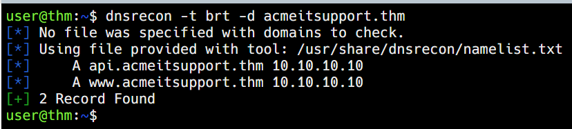
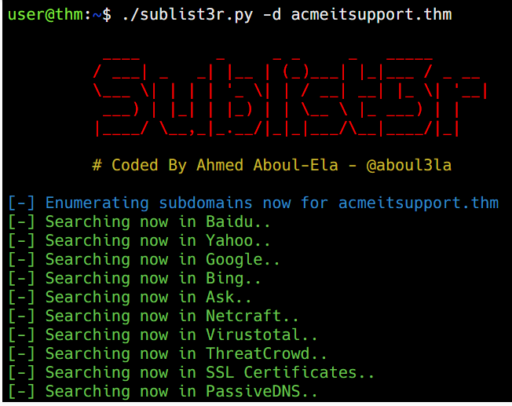
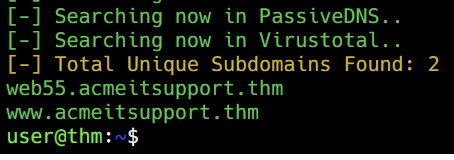
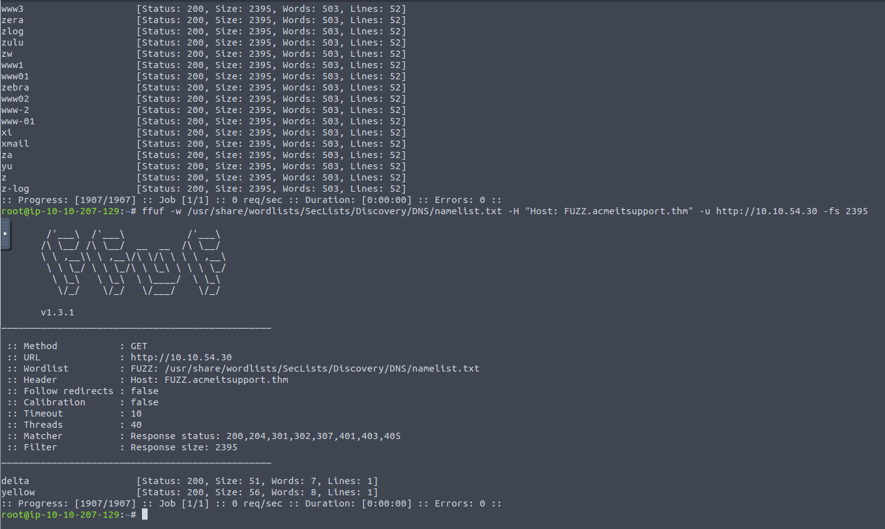

# Subdomain Enumeration
   
Learn the various ways of discovering subdomains to expand your attack surface of a target.

[Link](https://tryhackme.com/room/subdomainenumeration)


# 1: Brief

Subdomain enumeration is the process of finding valid subdomains for a domain, but why do we do this? We do this to expand our attack surface to try and discover more potential points of vulnerability.  
  
We will explore three different subdomain enumeration methods: Brute Force, OSINT (Open-Source Intelligence) and Virtual Host.  
  
Start the machine and then move onto the next task.

## Answer the questions below

What is a subdomain enumeration method beginning with B?

- Brute Force

What is a subdomain enumeration method beginning with O?

- OSINT

What is a subdomain enumeration method beginning with V?

- Virtual Host


# 2: OSINT - SSL/TLS Certificates

**SSL/TLS Certificates**

When an SSL/TLS (Secure Sockets Layer/Transport Layer Security) certificate is created for a domain by a CA (Certificate Authority), CA's take part in what's called "Certificate Transparency (CT) logs". These are publicly accessible logs of every SSL/TLS certificate created for a domain name. The purpose of Certificate Transparency logs is to stop malicious and accidentally made certificates from being used. We can use this service to our advantage to discover subdomains belonging to a domain, sites like [https://crt.sh](http://crt.sh/) and [https://ui.ctsearch.entrust.com/ui/ctsearchui](https://ui.ctsearch.entrust.com/ui/ctsearchui) offer a searchable database of certificates that shows current and historical results.

  

Go to [crt.sh](https://crt.sh/) and search for the domain name **tryhackme.com**, find the entry that was logged at **2020-12-26** and enter the domain below to answer the question.

## Answer the questions below

What domain was logged on crt.sh at 2020-12-26?

- store.tryhackme.com


# 3: OSINT - Search Engines

**Search Engines**

Search engines contain trillions of links to more than a billion websites, which can be an excellent resource for finding new subdomains. Using advanced search methods on websites like Google, such as the `site:` filter, can narrow the search results. For example, `-site:www.domain.com site:\*.domain.com` would only contain results leading to the domain name domain.com but exclude any links to www.domain.com; therefore, it shows us only subdomain names belonging to domain.com.

  

Go to [Google](https://www.google.com/) and use the search term **\-site:www.tryhackme.com  site:\*.tryhackme.com**, which should reveal a subdomain for tryhackme.com; use that subdomain to answer the question below.  

## Answer the questions below

What is the TryHackMe subdomain beginning with **B** discovered using the above Google search?

- blog.tryhackme.com


# 4: DNS Bruteforce

Bruteforce DNS (Domain Name System) enumeration is the method of trying tens, hundreds, thousands or even millions of different possible subdomains from a pre-defined list of commonly used subdomains. Because this method requires many requests, we automate it with tools to make the process quicker. In this instance, we are using a tool called dnsrecon to perform this. Click the "View Site" button to open the static site, press the "Run DNSrecon Request" button to start the simulation, and then answer the question below.  

## Answer the questions below

What is the first subdomain found with the dnsrecon tool?

- api.acmeitsupport.thm

- `dnsrecon -t brt -d acmeitsupport.thm`




# 5: OSINT - Sublist3r

**Automation Using Sublist3r**

To speed up the process of OSINT subdomain discovery, we can automate the above methods with the help of tools like [Sublist3r](https://github.com/aboul3la/Sublist3r), click the "View Site" button to open up the static site and run the sublist3r simulation to discover a new subdomain that will help answer the question below.

## Answer the questions below

What is the first subdomain discovered by sublist3r?

- web55.acmeitsupport.thm

- `sublist3r.py -d acmeitsupport.thm`






# 6: Virtual Hosts

Some subdomains aren't always hosted in publically accessible DNS results, such as development versions of a web application or administration portals. Instead, the DNS record could be kept on a private DNS server or recorded on the developer's machines in their /etc/hosts file (or c:\\windows\\system32\\drivers\\etc\\hosts file for Windows users) which maps domain names to IP addresses. 

Because web servers can host multiple websites from one server when a website is requested from a client, the server knows which website the client wants from the **Host** header. We can utilise this host header by making changes to it and monitoring the response to see if we've discovered a new website.

Like with DNS Bruteforce, we can automate this process by using a wordlist of commonly used subdomains.

Start an AttackBox and then try the following command against the Acme IT Support machine to try and discover a new subdomain.
  
```bash
# ffuf
user@machine$ ffuf -w /usr/share/wordlists/SecLists/Discovery/DNS/namelist.txt -H "Host: FUZZ.acmeitsupport.thm" -u http://10.10.54.30
```

The above command uses the **\-w** switch to specify the wordlist we are going to use. The **\-H** switch adds/edits a header (in this instance, the Host header), we have the **FUZZ** keyword in the space where a subdomain would normally go, and this is where we will try all the options from the wordlist.  

Because the above command will always produce a valid result, we need to filter the output. We can do this by using the page size result with the **\-fs** switch. Edit the below command replacing {size} with the most occurring size value from the previous result and try it on the AttackBox.  

```bash
# ffuf
user@machine$ ffuf -w /usr/share/wordlists/SecLists/Discovery/DNS/namelist.txt -H "Host: FUZZ.acmeitsupport.thm" -u http://10.10.54.30 -fs {size}
```

This command has a similar syntax to the first apart from the **\-fs** switch, which tells ffuf to ignore any results that are of the specified size.  

The above command should have revealed two positive results that we haven't come across before.  

## Answer the questions below

`ffuf -w /usr/share/wordlists/SecLists/Discovery/DNS/namelist.txt -H "Host: FUZZ.acmeitsupport.thm" -u http://10.10.54.30 -fs 2395`

What is the first subdomain discovered?

- delta

What is the second subdomain discovered?

- yellow

